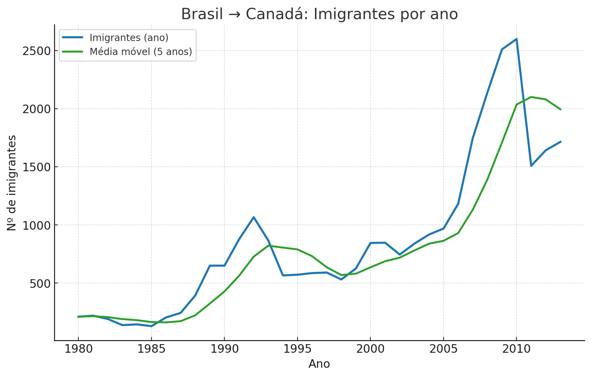
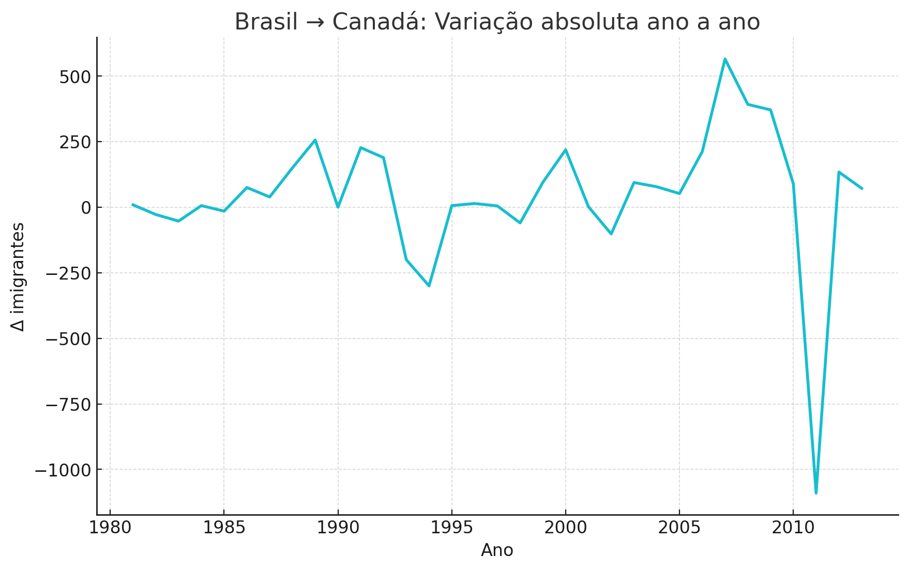
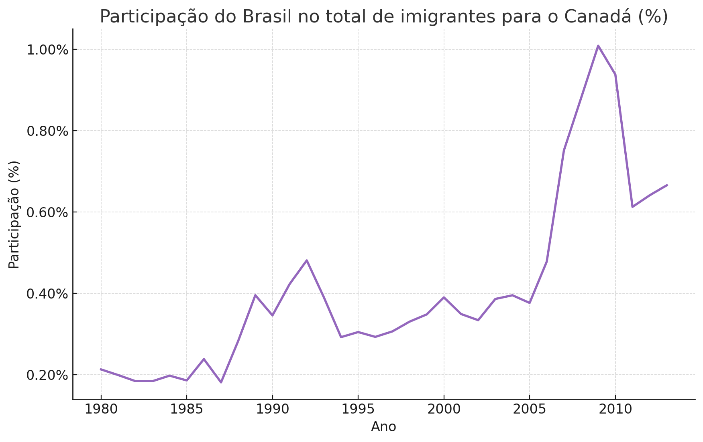
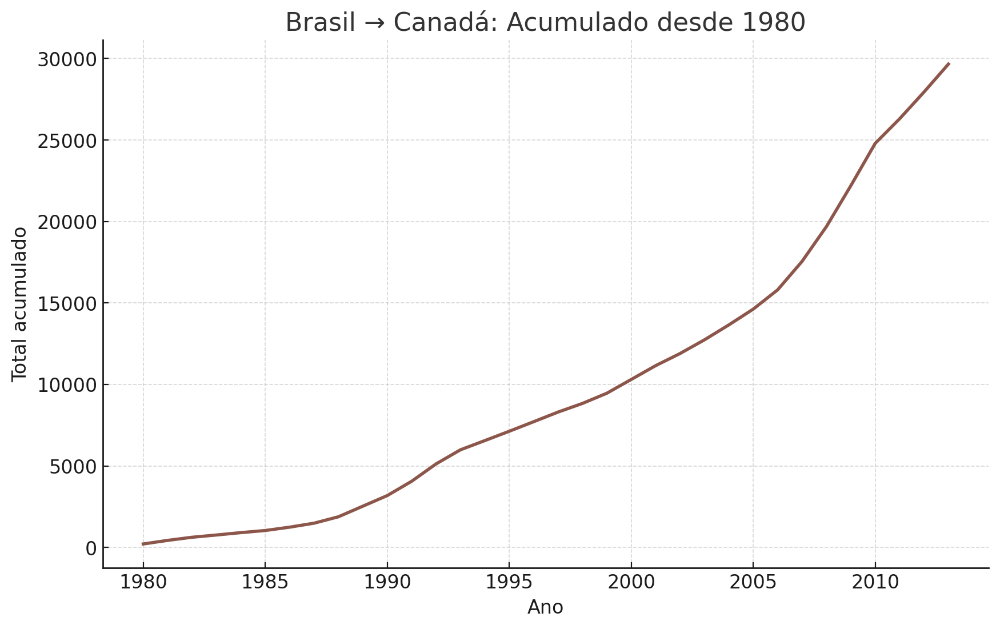
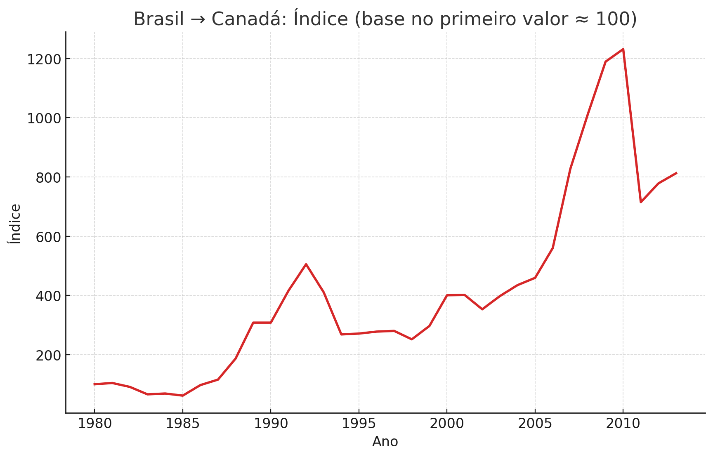
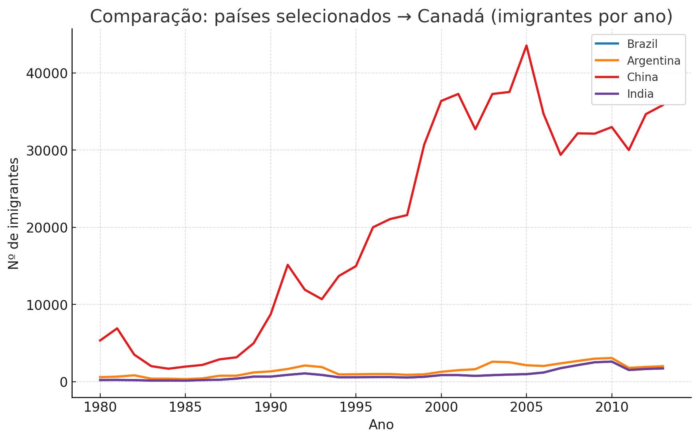
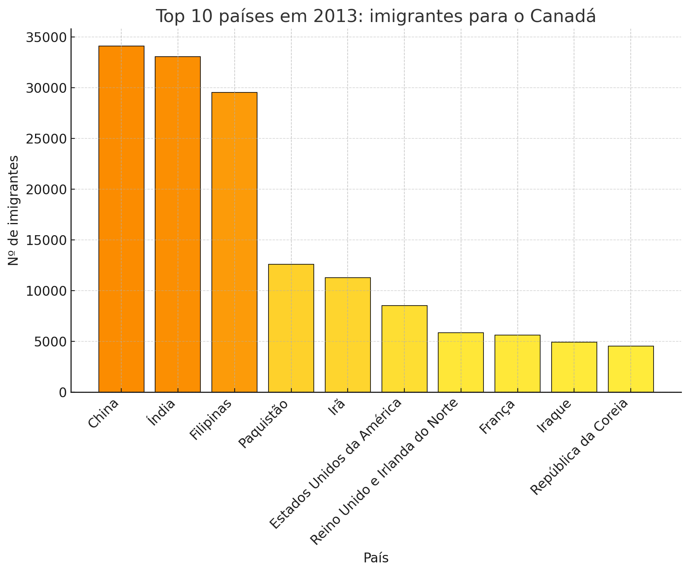
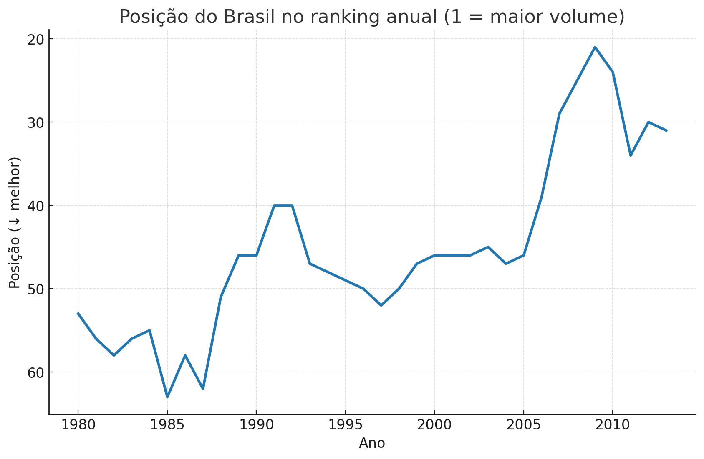
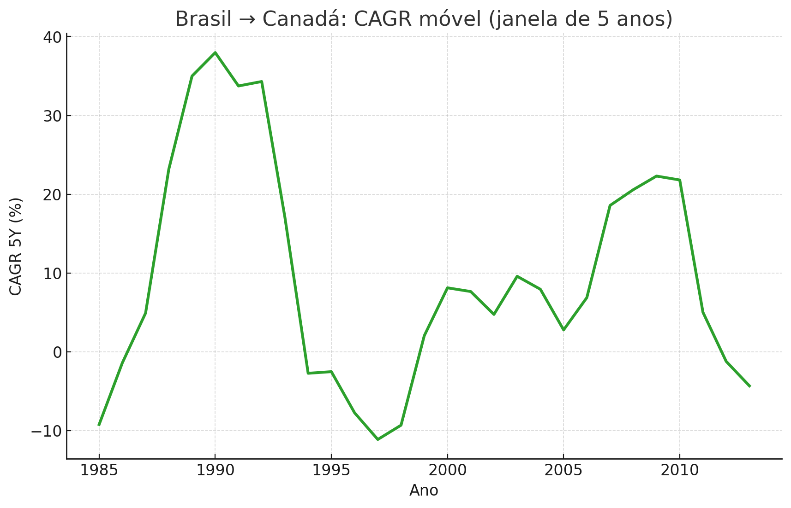
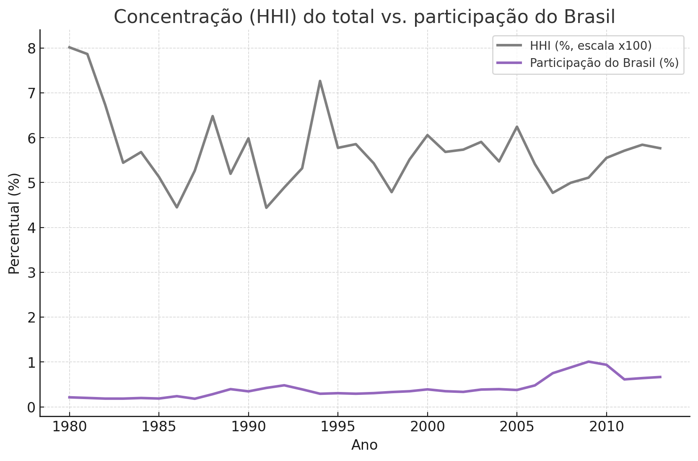

# Imigração do Brasil para o Canadá (1980+)

Análise exploratória da evolução da imigração do **Brasil → Canadá** usando um dataset anual por país (a partir de 1980).  
Este repositório contém notebooks prontos para executar, gráficos exportados e um fluxo reproduzível.

## 🎯 Objetivos
- Entender **tendências** de longo prazo, **oscilações** de curto prazo e **relevância relativa** do Brasil.
- Produzir gráficos claros (um por célula) e salvar as figuras em `exports/`.
- Oferecer análises essenciais com **texto de contexto antes** e **resumo depois** de cada gráfico.

## 📦 Conteúdo principal
- **`imigracao_brasil_canada_unico.ipynb`** — *Notebook principal (recomendado)* com todos os gráficos e as 3 análises essenciais:
  1. Série anual do Brasil + MM5
  2. Variação ano a ano (Δ)
  3. Participação do Brasil (%) no total
  4. Acumulado desde 1980
  5. Índice (base ≈ 100)
  6. Comparação entre países (Brasil, Argentina, China, Índia)
  7. Top 10 do último ano com **degradê amarelo → laranja**
  8. **Ranking anual do Brasil** (1 = maior fluxo)
  9. **CAGR móvel (5 anos)**
  10. **Concentração (HHI)** vs. participação do Brasil

- **`imigracao_brasil_canada_unico_renderizado.ipynb`** — Mesma versão **com outputs embutidos** (abre sem precisar reexecutar).
- **Outros notebooks úteis (opcional):**
  - `imigracao_brasil_canada_completo_gradiente(_renderizado).ipynb` — versão completa com o degradê já aplicado ao Top 10.
  - `imigracao_brasil_canada_refeito_cores(_renderizado).ipynb` — versão com paleta de alto contraste.
  - `imigracao_brasil_canada_3_analises(_renderizado).ipynb` — caderno focado nas 3 análises essenciais.

> As figuras e arquivos gerados são salvos em `exports/` (por exemplo, `exports/01_brasil_imigrantes_por_ano.png`).

## 🗂️ Dados
- Espera-se um arquivo CSV chamado **`imigrantes_canada.csv`** na raiz do projeto (ou ajuste o caminho na primeira célula).
- O notebook **detecta automaticamente** a coluna de país (ex.: `País`, `Country`, `ODNAME`) e as colunas de anos (1980…).
- **Atenção à licença**: verifique se você pode **redistribuir** o CSV antes de publicar em repositório público.

## 🛠️ Como reproduzir
Recomendado usar Python 3.10+ e um ambiente virtual:

```bash
python -m venv .venv
source .venv/bin/activate      # Windows: .venv\Scripts\activate
pip install -r requirements.txt
# (Opcional) Se quiser variar estilos locais:
# pip install seaborn
```

Execute o Jupyter e abra o notebook principal:
```bash
jupyter lab        # ou: jupyter notebook
```

Depois de rodar as células, os resultados serão salvos em `./exports/`:
- PNGs de todos os gráficos (inclui o **Top 10 com degradê amarelo → laranja**)
- CSV com a série do Brasil: `exports/brasil_imigracao_canada_serie.csv`
- Resumos/insights quando disponíveis (ex.: `exports/resumo_brasil_canada.txt`)

## 🔍 O que cada análise responde
- **Série + MM5**: tendência estrutural e pontos de inflexão.
- **Δ ano a ano**: acelerações/recuos de curto prazo.
- **Participação (%)**: ganho de relevância do Brasil vs. mercado total.
- **Acumulado**: contribuição total ao longo das décadas.
- **Índice base ≈ 100**: crescimento relativo independente do nível inicial.
- **Comparação entre países**: posição do Brasil vs. Argentina/China/Índia.
- **Top 10 (último ano)**: liderança por volume e distância entre países (com degradê amarelo→laranja).
- **Ranking anual do Brasil**: competitividade relativa (1 = maior fluxo).
- **CAGR 5Y**: períodos sustentados de expansão/contração.
- **HHI vs. participação**: estrutura do “mercado” (concentração) versus ganho relativo do Brasil.

## 🚀 Publicar no GitHub (rápido)
**Via site (mais simples):**
1. Crie um repositório em https://github.com/new (ex.: `imigracao-brasil-canada`).
2. Clique em **Add file → Upload files** e suba: notebooks, `requirements.txt`, `.gitignore`, `exports/` e **(opcional)** `imigrantes_canada.csv`.
3. Faça o *commit*.

**Via linha de comando:**
```bash
git init
git add .
git commit -m "Análise: imigração Brasil → Canadá (1980+)"
git branch -M main
git remote add origin https://github.com/SEU_USUARIO/imigracao-brasil-canada.git
git push -u origin main
```

> Dica: para HTTPS, use um **PAT (Personal Access Token)**. Para SSH, cadastre sua chave pública no GitHub.

## 📄 Licença
- Recomendo incluir uma licença como **MIT** para o código.
- Verifique a licença dos **dados** antes de tornar o repositório público.

## 🙌 Créditos
- Notebooks e scripts criados automaticamente com Python (**Matplotlib**).  
- Paletas ajustadas para melhor contraste e um gráfico com **degradê amarelo→laranja**.


## 🖼️ Pré-visualização rápida

<p align="center">
  
  
  
</p>

<p align="center">
  
  
  
</p>

<p align="center">
  
  
  
</p>

<p align="center">
  
</p>

